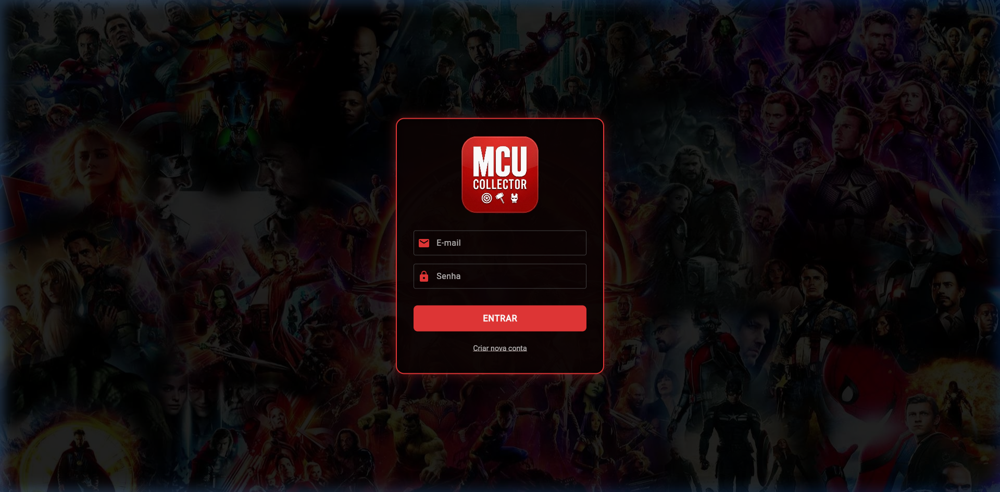

<p align="center">
  
</p>

<h1 align="center">🦸 MCU Collector</h1>

<p align="center">
  <strong>Seu álbum de figurinhas digital do Universo Cinematográfico Marvel</strong>
</p>

<p align="center">
  <a href="https://mcu-collector.netlify.app">🌐 Versão Web</a> •
  <a href="https://github.com/CamilaGVitoria/mcu_collector/releases/tag/v1.0.0">📱 Download APK</a>
</p>

<p align="center">
  
  
  
  
  
</p>

---

> 🇧🇷 **[Português](#-português)** | 🇺🇸 **[English](#-english)**

---

# 🇧🇷 Português

## 📖 Sobre o Projeto

O **MCU Collector** é uma aplicação **web e mobile** que transforma a paixão pela Marvel em um grande **álbum de figurinhas interativo**. O usuário rastreia, organiza e completa uma coleção digital de personagens do Universo Cinematográfico da Marvel (MCU) e de seus multiversos.

A plataforma apela para o instinto completista: desbloquear todos os personagens, acompanhar seu progresso e sentir a satisfação visual a cada nova conquista.

> ⚠️ **Nota:** O catálogo não inclui todos os personagens existentes no MCU, pois são milhares. O foco deste projeto é demonstrar habilidades de **desenvolvimento front-end**. O sistema é escalável — qualquer personagem adicionado no banco de dados aparece automaticamente na página de cada usuário.

## 🎮 A Jornada do Usuário

### 🛡️ O Alistamento
O usuário assume a identidade de um **Agente da S.H.I.E.L.D.**, criando sua conta e gerenciando seu perfil com codinome e avatar personalizado.

### 🔍 A Caçada
Ao entrar no app, o usuário encontra um catálogo vasto de personagens. Os que ainda não foram "capturados" aparecem com **efeito de desfoque (blur)** e uma **camada escura**, criando mistério e incentivando a exploração.

### ✅ A Conquista
Ao adicionar um personagem à coleção, a imagem se revela nítida, ganhando uma **moldura vermelha de destaque** e um **ícone de check** — uma recompensa visual imediata.

### 🎛️ Controle e Precisão
O painel de controle no topo oferece:
- **Progresso numérico** (coletados / total)
- **Busca** por nome
- **Filtros avançados** por alinhamento (Herói, Vilão, Anti-Herói...), tipo de poder (Mutante, Místico, Cósmico...) e habilidade (Artes Marciais, Gênio, Piloto...)
- **Toggle "Na Coleção"** para visualizar apenas os personagens desbloqueados

## 🏗️ Arquitetura & Stack Técnica

| Camada | Tecnologia | Descrição |
|---|---|---|
| **Framework** | Flutter 3.12+ | Aplicação cross-platform (Web + Android) |
| **Linguagem** | Dart | Tipagem forte, null safety |
| **Arquitetura** | MVC | Separação clara de responsabilidades |
| **Estado** | Provider | Gerenciamento de estado reativo |
| **Backend** | Supabase | Autenticação, banco de dados e armazenamento em nuvem |
| **Deploy Web** | Netlify | Build e hosting otimizado para Flutter Web |
| **Tipografia** | Google Fonts | Fonte estilizada para a identidade visual |

## 📁 Estrutura do Projeto

```
lib/
├── main.dart                          # Ponto de entrada, inicialização do Supabase e Provider
├── controllers/
│   └── marvel_controller.dart         # Lógica de negócio, filtros e gerenciamento de estado
├── models/
│   └── marvel_character.dart          # Modelo de dados do personagem Marvel
├── services/
│   ├── storage_service.dart           # CRUD da coleção do usuário no Supabase
│   └── profile_service.dart           # Gerenciamento do perfil do agente
├── theme/
│   └── app_colors.dart                # Paleta de cores da aplicação
├── views/
│   ├── auth_view.dart                 # Tela de login e cadastro
│   ├── home_view.dart                 # Tela principal com grid de personagens
│   ├── character_detail_view.dart     # Detalhes do personagem selecionado
│   └── profile_view.dart              # Edição de perfil e alteração de senha
└── widgets/
    └── character_image_card.dart       # Card reutilizável com efeito blur/reveal
```

## 🔧 Como Executar Localmente

### Pré-requisitos

- [Flutter SDK](https://docs.flutter.dev/get-started/install) (3.12+)
- Uma conta no [Supabase](https://supabase.com) com o projeto configurado

### Passo a Passo

1. **Clone o repositório:**
   ```bash
   git clone https://github.com/CamilaGVitoria/mcu_collector.git
   cd mcu_collector
   ```

2. **Configure as variáveis de ambiente:**

   Crie um arquivo `env.txt` na raiz do projeto:
   ```
   SUPABASE_URL=sua_url_do_supabase
   SUPABASE_PUBLISHABLE_KEY=sua_chave_publica
   ```

3. **Instale as dependências:**
   ```bash
   flutter pub get
   ```

4. **Execute o app:**
   ```bash
   # Web
   flutter run -d chrome

   # Android
   flutter run -d android
   ```

### Banco de Dados (Supabase)

O projeto utiliza as seguintes tabelas no Supabase:

| Tabela | Descrição |
|---|---|
| `characters` | Catálogo de personagens (nome, universo, imagem, alinhamento, poder, habilidade, descrição) |
| `collected_characters` | Relação usuário ↔ personagem coletado |
| `profiles` | Perfil do agente (nome de exibição, avatar) |

## 🌐 Deploy

| Plataforma | Link |
|---|---|
| **Web (Netlify)** | [mcu-collector.netlify.app](https://mcu-collector.netlify.app) |
| **Android (APK)** | [Releases v1.0.0](https://github.com/CamilaGVitoria/mcu_collector/releases/tag/v1.0.0) |

## 📄 Licença

Este projeto está sob a licença MIT. Veja o arquivo [LICENSE](LICENSE) para mais detalhes.

## 👩‍💻 Autora

**Camila Gonçalves Vitória**

> 🤖 *README elaborado com auxílio da IA [Claude](https://claude.ai).*

---

# 🇺🇸 English

## 📖 About the Project

**MCU Collector** is a **web and mobile application** that turns the love for Marvel into a **interactive digital sticker album**. Users can track, organize, and complete a digital collection of characters from the Marvel Cinematic Universe (MCU) and its multiverses.

The platform taps into the completionist instinct: unlock every character, track your progress, and feel the visual satisfaction with each new achievement.

> ⚠️ **Note:** The catalog does not include every MCU character, as there are thousands. The focus of this project is to demonstrate **front-end development skills**. The system is scalable — any character added to the database automatically appears on every user's page.

## 🎮 The User Journey

### 🛡️ Enrollment
The user takes on the identity of a **S.H.I.E.L.D. Agent**, creating an account and managing their profile with a codename and custom avatar.

### 🔍 The Hunt
Upon entering the app, the user finds a vast character catalog. Characters not yet "captured" appear with a **blur effect** and a **dark overlay**, creating mystery and encouraging exploration.

### ✅ The Achievement
When a character is added to the collection, the image is revealed in full clarity, gaining a **red highlight border** and a **check icon** — an immediate visual reward.

### 🎛️ Control & Precision
The control panel at the top provides:
- **Numeric progress** tracking (collected / total)
- **Search** by name
- **Advanced filters** by alignment (Hero, Villain, Anti-Hero...), power type (Mutant, Mystic, Cosmic...) and skill (Martial Arts, Genius, Pilot...)
- **"In Collection" toggle** to view only unlocked characters

## 🏗️ Architecture & Tech Stack

| Layer | Technology | Description |
|---|---|---|
| **Framework** | Flutter 3.12+ | Cross-platform app (Web + Android) |
| **Language** | Dart | Strong typing, null safety |
| **Architecture** | MVC | Clear separation of concerns |
| **State** | Provider | Reactive state management |
| **Backend** | Supabase | Authentication, database & cloud storage |
| **Web Deploy** | Netlify | Optimized build and hosting for Flutter Web |
| **Typography** | Google Fonts | Stylized font for visual identity |

## 📁 Project Structure

```
lib/
├── main.dart                          # Entry point, Supabase & Provider setup
├── controllers/
│   └── marvel_controller.dart         # Business logic, filters & state management
├── models/
│   └── marvel_character.dart          # Marvel character data model
├── services/
│   ├── storage_service.dart           # User collection CRUD on Supabase
│   └── profile_service.dart           # Agent profile management
├── theme/
│   └── app_colors.dart                # Application color palette
├── views/
│   ├── auth_view.dart                 # Login and registration screen
│   ├── home_view.dart                 # Main screen with character grid
│   ├── character_detail_view.dart     # Selected character details
│   └── profile_view.dart              # Profile editing and password change
└── widgets/
    └── character_image_card.dart       # Reusable card with blur/reveal effect
```

## 🔧 How to Run Locally

### Prerequisites

- [Flutter SDK](https://docs.flutter.dev/get-started/install) (3.12+)
- A [Supabase](https://supabase.com) account with the project set up

### Step by Step

1. **Clone the repository:**
   ```bash
   git clone https://github.com/CamilaGVitoria/mcu_collector.git
   cd mcu_collector
   ```

2. **Set up environment variables:**

   Create an `env.txt` file in the project root:
   ```
   SUPABASE_URL=your_supabase_url
   SUPABASE_PUBLISHABLE_KEY=your_public_key
   ```

3. **Install dependencies:**
   ```bash
   flutter pub get
   ```

4. **Run the app:**
   ```bash
   # Web
   flutter run -d chrome

   # Android
   flutter run -d android
   ```

### Database (Supabase)

The project uses the following Supabase tables:

| Table | Description |
|---|---|
| `characters` | Character catalog (name, universe, image, alignment, power, skill, description) |
| `collected_characters` | User ↔ collected character relationship |
| `profiles` | Agent profile (display name, avatar) |

## 🌐 Deployment

| Platform | Link |
|---|---|
| **Web (Netlify)** | [mcu-collector.netlify.app](https://mcu-collector.netlify.app) |
| **Android (APK)** | [Releases v1.0.0](https://github.com/CamilaGVitoria/mcu_collector/releases/tag/v1.0.0) |

## 📄 License

This project is licensed under the MIT License. See the [LICENSE](LICENSE) file for details.

## 👩‍💻 Author

**Camila Gonçalves Vitória**

> 🤖 *README written with the assistance of [Claude](https://claude.ai) AI.*
